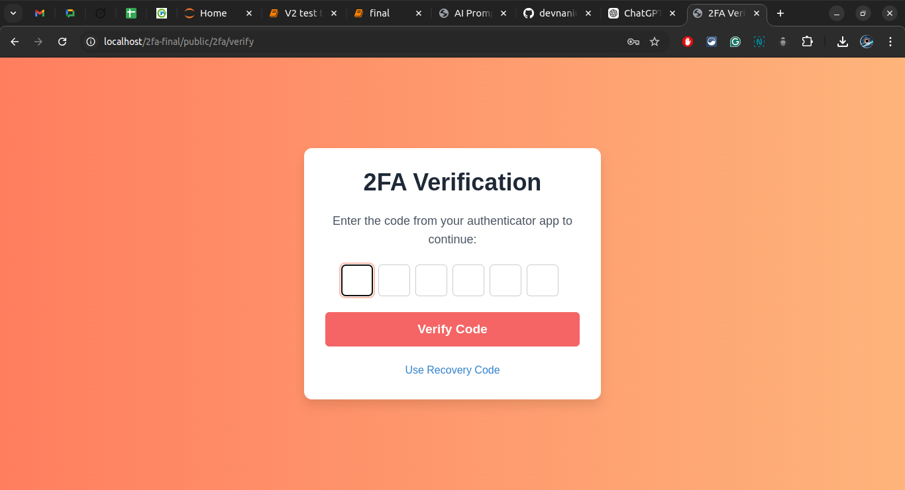

# Laravel Two-Factor Authentication (2FA) App

This is a **Laravel-based 2FA application** that adds an extra layer of security by integrating two-factor authentication (2FA) into your Laravel app. It supports a wide range of authenticator apps, such as **Google Authenticator**, **Microsoft Authenticator**, **Salesforce Authenticator**, and many others.

---

## Features

- **Secure Login** with Two-Factor Authentication
- **Compatible** with major authenticator apps (Google, Microsoft, Salesforce, etc.)
- **QR Code** generation for easy scanning in authenticator apps
- **Backup codes** for emergency access
- **User-Friendly Interface** for enabling and managing 2FA
- **Support for multiple devices** to authenticate

---

## Screenshots

### 1. Login Page

### 2. Verification with Authenticator App

### 3. Verification with recovery code

### 4. Register page

### 5. Backup Codes Page and Qr scan page

### 6. Dashboard

---

## How to Use

1. **Register/Login** to your account.
2. Scan the **QR Code** with your preferred authenticator app (Google, Microsoft, Salesforce, etc.).
3. Enter the **verification code** generated by your authenticator app.
4. Your account will now be secured with 2FA, requiring a verification code on each login.

---

## Technologies Used

- **Laravel 11**
- **PHP 8.2**
- **JavaScript (optional for QR code generation)**
- **Authenticator App Support**: Google, Microsoft, Salesforce, and more.

---

## License

This project is open-sourced software licensed under the [MIT license](https://opensource.org/licenses/MIT).

---

Feel free to customize the project according to your needs and contribute to its development!

---

### Future Enhancements

- **SMS and Email-based 2FA** for broader security options.
- **Admin Panel** for managing user 2FA status.
